# Iron Series Build Guide

This build guide was originally written specifically for the Iron180, however since the build and assembly process is nearly the same, this guide has been updated (and will continue to be updated) to better cover all boards currently in the Iron series.

***Disclaimer***

While this guide is meant to give Iron180 owners a comprehensive overview of how to build a 180, please keep in mind that there are many variations/alternatives to some of the processes described here. At the end of the day, some of these choices comes down to preference, so do not worry if you see other individuals building boards in a different way. That being said, if you are more of a visual person and would rather see videos, we have provided a few links to build streams below.

## Table of contents

* [Parts check and PCB](#parts-check-and-pcb)
* [Dissasembly](#dissasembly)
* [Bumpons, Daughterboard, and Gaskets](#bumpons-daughterboard-and-gaskets)
* [Stabilizers and Layout](#stabilizers-and-layout)
* [Switches](#switches)
* [Soldering](#soldering)
* [Reassembly](#reassembly)

## Parts check and PCB

Before building the Iron180, it is important to take a few precautionary steps. Before you take anything apart or start building, we recommend that you double-check the [parts list](Iron180PartsList.md) to ensure that nothing is missing.

You can also refer to the following photo as a color-coded to part list throughout the build.

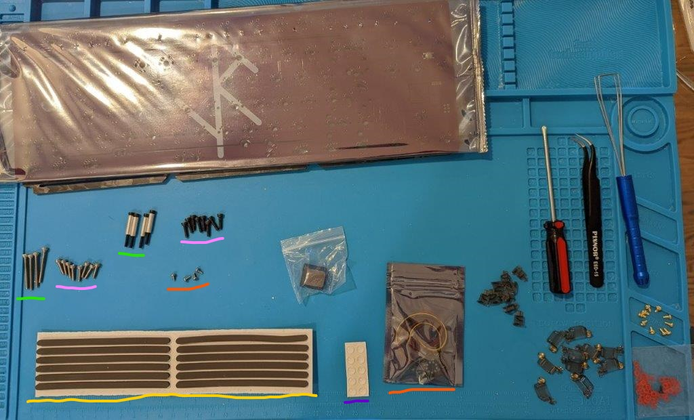

### Screws

There are multiple options when it comes to screws for the back of your Iron180. There are duplicate sets for color preferences as well as short and long screws. The short screws are the standard option that will not be visible when tightened, whereas the longer option allows the screws to sit flush with the bottom of the board, giving it a unique aesthetic appeal. You will always use four short screws (pink underline) for the front of the board.

Note: *If you decide to use the longer screws (green underline), you will need to be used with the included spacers before tightening. Failure to do so might result in damage to your board.*

### Checking your PCB

With more modern manufacturing processes, it is very tempting to skip this step, but we highly recommend that you take the time to test your PCB. Spending a few hours building your board only to find out after that something is wrong and you need to disassemble everything is going to be a bad time. Unless you have the proper equipment to desolder, it will take you a lot longer to disassemble than reassemble.

To test your board, you will need a pair of metal tweezers, the included PCB (connected to the daughterboard), and a USB-C cable. Ensure that your PCB is in an environment to minimize electrostatic discharge before proceeding and connect your PCB via the USB cable to a PC. While connected, please open a keyboard testing website (a few links below) and take your tweezer and touch the pair of pads corresponding to a key and check to see that the circuit completes and that it registers on the site. [Example video](https://www.youtube.com/watch?v=0Jp1X0hrAeM)

Keyboard testing websites/software

* [Keyboard Checker](https://keyboardchecker.com/)
* [Keyboard Tester](https://www.keyboardtester.com/)
* [VIA](https://caniusevia.com/)

Quick Tip: Instead of looking up after testing each key, it is faster to test every key in a row, then ensure that the entire row lights up.

Note: *You will not see the function key light up via this method. You will need to use a second pair of tweezers in conjunction to ensure that it registers. Our favorite is FN + 1, which will open a new tab when in chrome.*

## Dissasembly

Remove the board from the case and use the included cloth to lay the board face down on a flat surface. You will need to remove the eight hex screws (blue underline below) from the back of the board and gently lift the base up, and pull the base out an angle towards the back of the board.

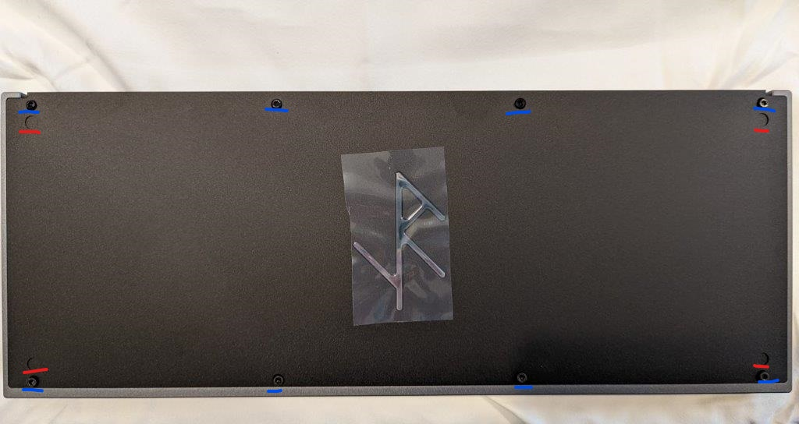
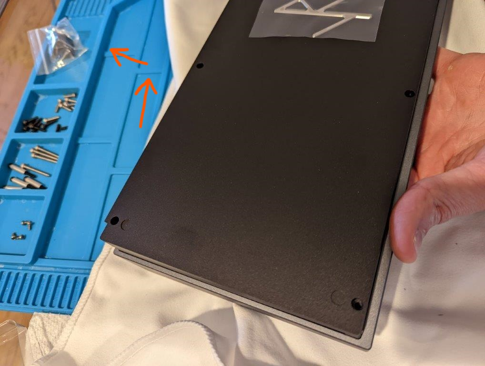

## Bumpons, Daughterboard, and Gaskets

Since we are going to move halves of the boards around individually, it is now a good time to attach the bumpons. Remove a bumpon from the adhesive, then attach it to the bottom of the base (red underline below) using one of the four circular matching indents as a guide. Repeat for the other three bumpons.

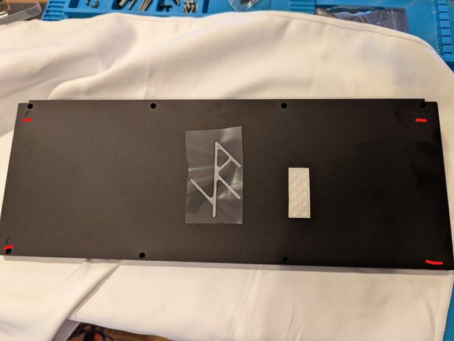

Proceed to flip the board face-up, grab the four smaller screws and attach the daughterboard to the case using the four smallest screws (orange underline in parts and diagram below).

Note: *Do not overtighten the screws; turn them just enough to where it starts to give resistance, and the daughterboard no longer jiggles. It is also easier if you attach one end of the cable to the daughterboard before screwing it in. If you happen to install the gaskets prior to installing the daughterboard, you should still be able to access the top screws without disturbing the gasket adhesive.*

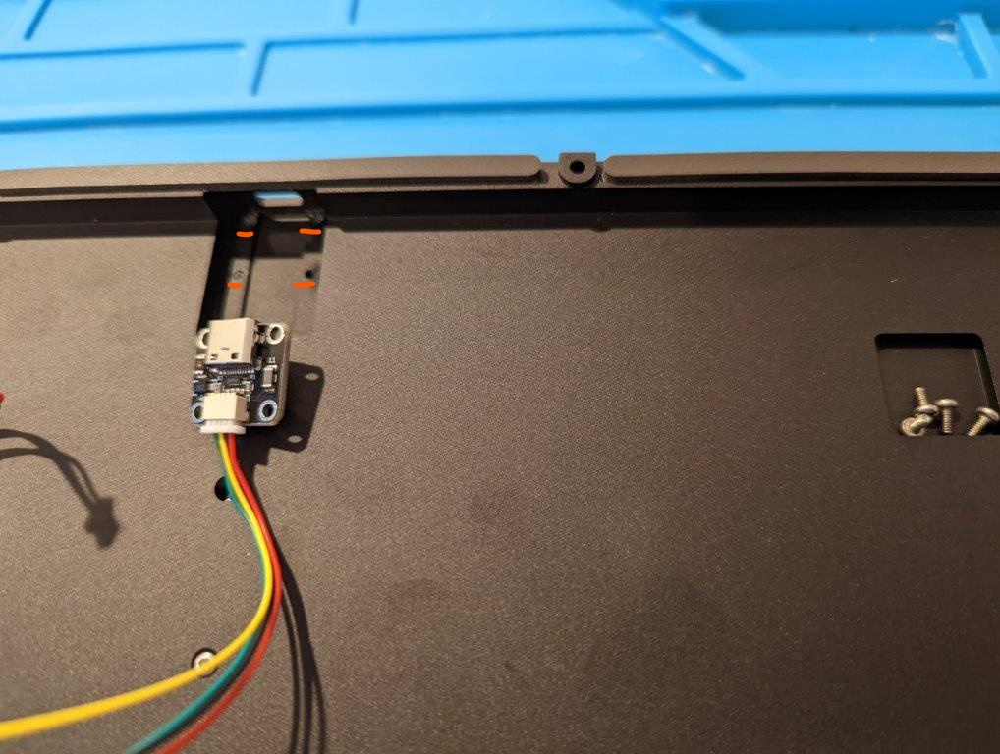
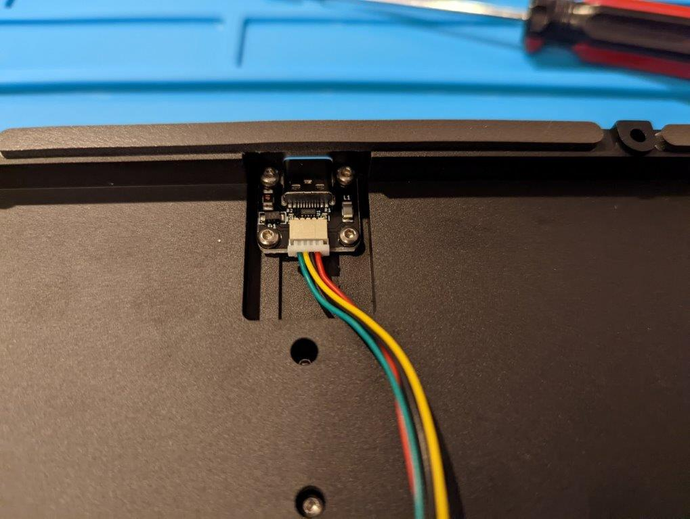

Now that your bumpons and daughterboard are attached, we will focus on attaching the gaskets.

We recommend you use a pair of tweezers for this step, but you can get by with using your hands. You will notice a slight recess on both the insides of the top and bottom of the 180 which we will use as a guide for gasket application. While removing adhesive protection and attaching gaskets to a board may sounds trivial, we do have a few tips for quality control.

When applying the gasket, do not pull or add tension to the gasket during application. You want all of your gaskets to have an even feel across the plate while also allowing for compression. The easiest way to do so is by slowly guiding the gasket into place over the length of the track by using tweezers to set the initial gasket and using your finger to follow the track/push down. Also, ensure that the gasket is on the track itself and not pushed along the wall, which may result in twisting/inconsistent compression across the gasket.

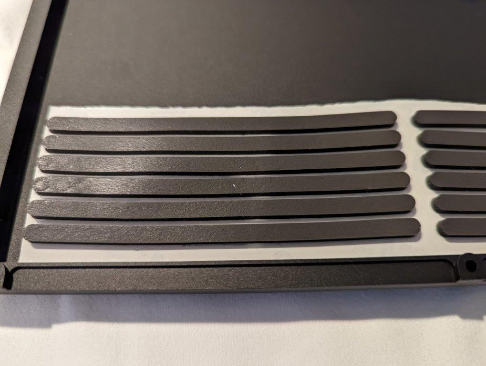
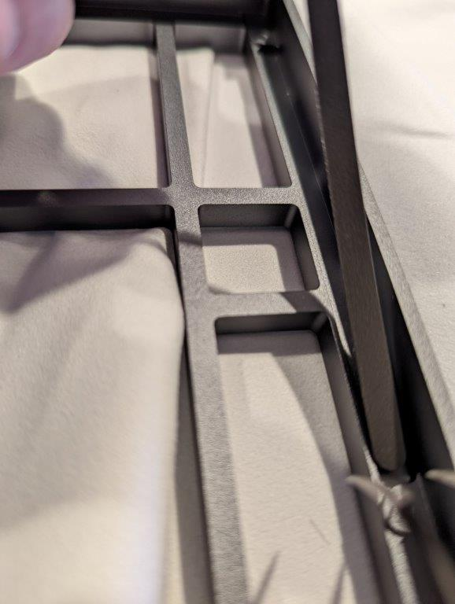

Proceed to attach all twelve gaskets (yellow underline parts) to the top and bottom of the board and set the top and bottom of the board to the side until the end of the build.

## Stabilizers and Layout

Now is the time to plan the layout of your 180. Please use the image below to see what options are available. There are lots of guides/variations available on how to modify/attach/lube stabilizers, but we will be using the electrical tape mod (variation of the band-aid mod)for this guide.

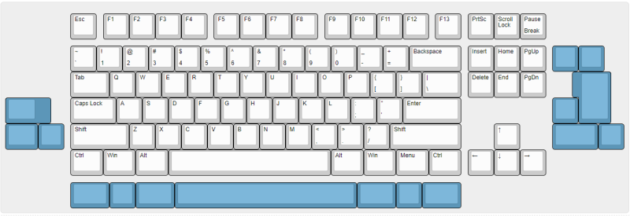

Using a roll of electrical tape, cut out tiny rectangles so that they fit in between the stabilizer mounting points on the top of the PCB. After they have been all attached, spread a thin layer of dielectric grease to each of the rectangles. Proceed to attach all of your lubed stabilizers.

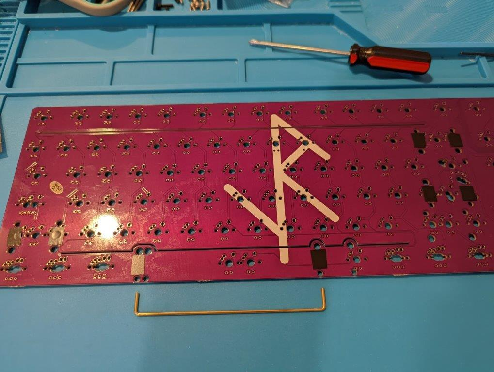
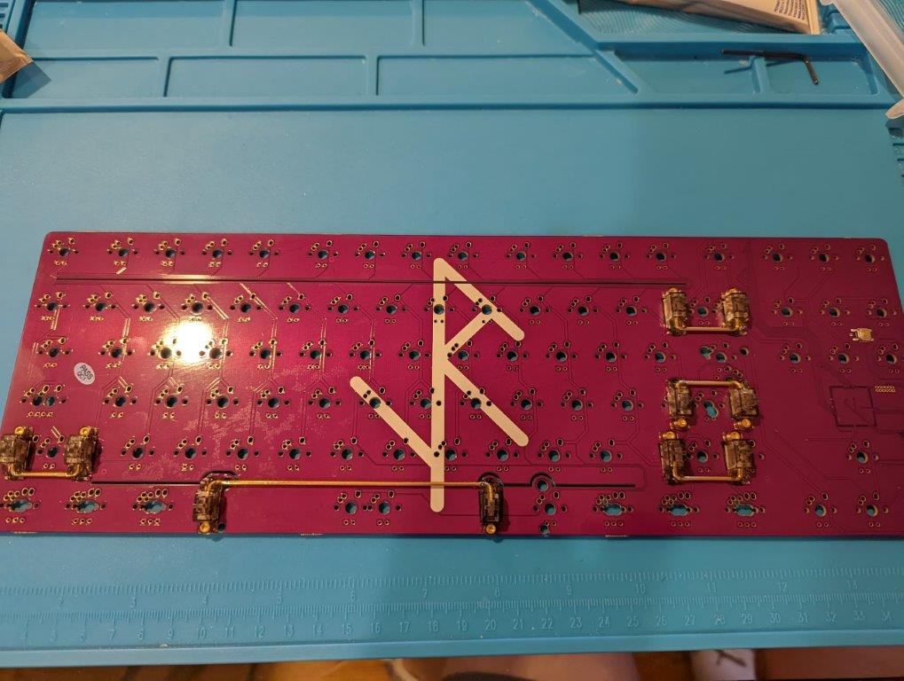

Videos on lubing stabilizers:

[Lubing stabilizers](https://www.youtube.com/watch?v=usNx1_d0HbQ)
[Band-aid Mod](https://www.youtube.com/watch?v=cD5Zj-ZgMLA)

Fun fact: Lbaron prefers a full backspace board, while Vox prefers a split backspace.

## Switches

Now that your stabilizers are in place, it is time to insert your switches into the plate. Align the plate on top of your stabilizer and grab one switch to align it over one of the corners on the plate. Using low to moderate force, push the switch directly down so that it seats into the plate fully while making sure the pins of the switch come out the other side of the PCB. Continue to add switches around each corner of the PCB.

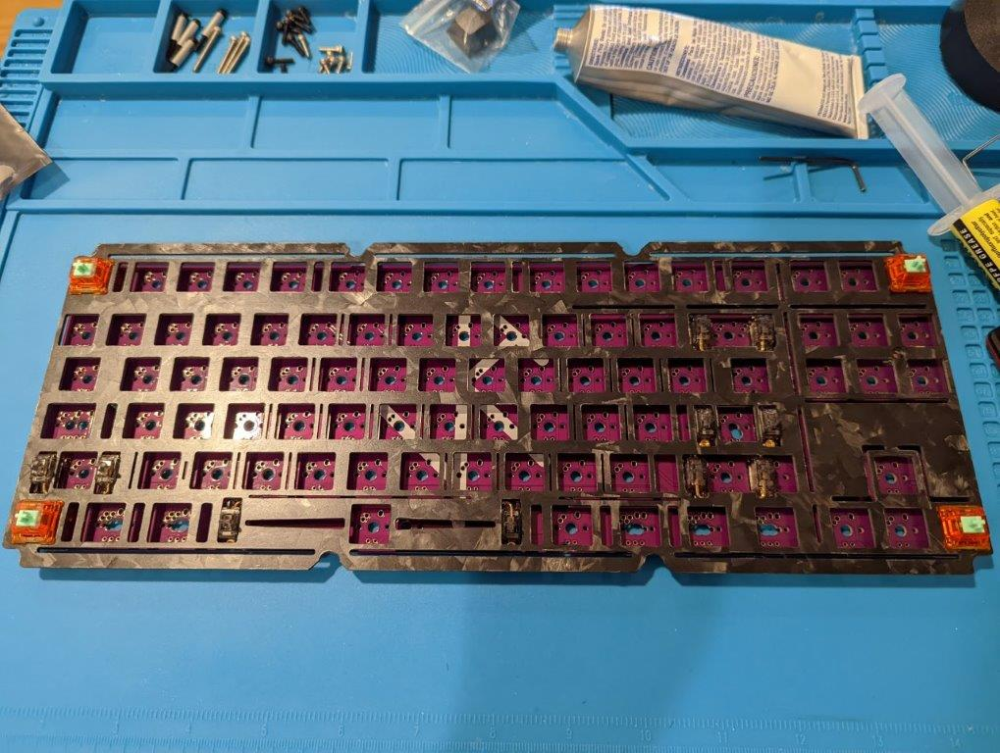

Once all four corners are inserted, add switches to the bottom row as well as the full/split backspace area. After that is done, it is a good time to double-check that you chose the right mounting points for your switches to avoid having to desolder/resolder. Take the corresponding caps from the intended keyset and attach them to the top of each switch to verify the correct layout. Once confirmed, insert switches throughout the reset of the plate/PCB, double-checking that both pins for each switch go through the PCB and do not bend.

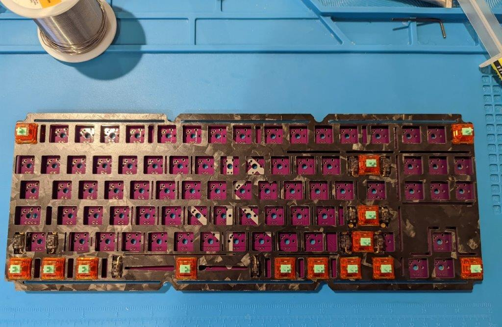
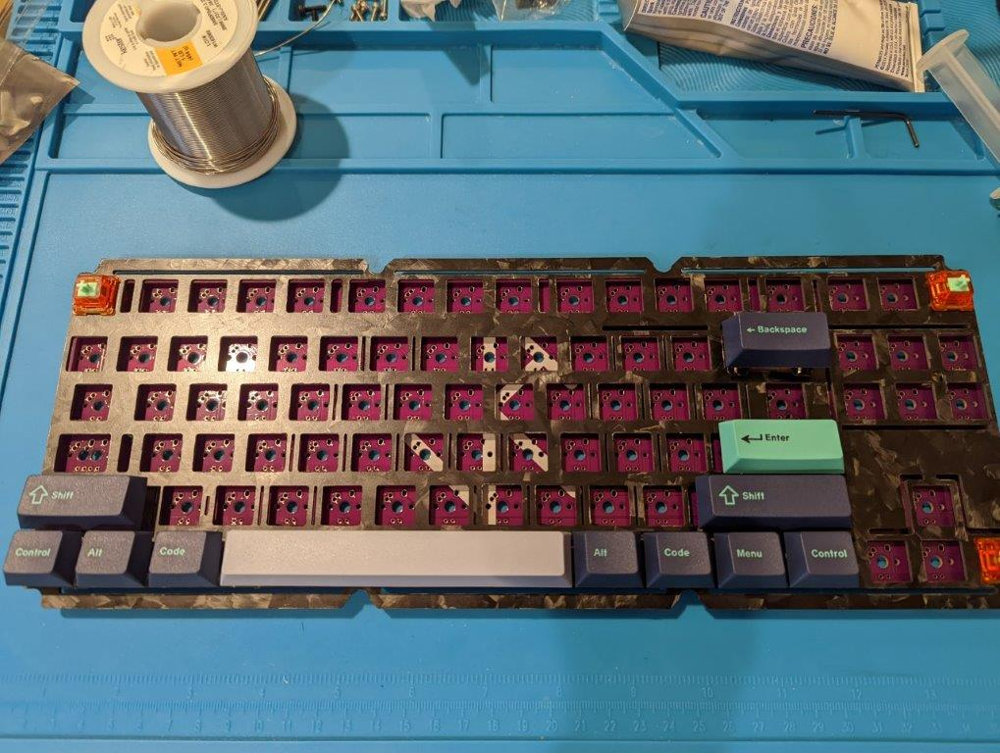

Once you have verified your layout, insert the remainder of the switches throughout the plate.

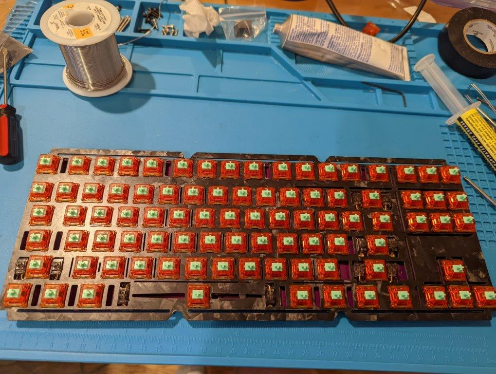

## Soldering

There are many comprehensive guides on soldering, so we will skip any specific details in this section. Here is a [video](https://www.youtube.com/watch?v=cRJV1jo5vao) we think you might find helpful.

After soldering all of your switches, now is another good time to test out your switches. Connect your PCB to the daughterboard and rest it inside the bottom of the case. Use your favorite switch testing website and ensure that all of your switches are working.

## Reassembly

**The reassembly process detailed below is EXTREMELY IMPORTANT for Iron series keyboards made from polycarbonate (PC). Polycarbonate is much softer than aluminum, which means extra care must be taken during reassembly.**

It is now time to start putting everything back together. Ensure that the plate/PCB combo is seated into your Iron correctly. There is a little bit of wiggle room, and you can potentially misalign it before assembling, so please make sure to double-check before assembly. Once the top is aligned over the plate/base, keep a firm grip on the board and flip it over on a soft cloth face down. Have the (8) M2.5x10m case screws handy to screw back into the board.

Starting at position #1 (see below), drop the screw in the bottom case screw hole.  Using your free hand squeeze the board tight next to position #1 to compress the gaskets. This can be accomplished either by pressing down on the base while the board is laying on a flat surface (see below) or with both the top and bottom grasped together in one hand. Proceed to screw in the case screw approximately 2mm or four full rotations.

**Note:** *We **strongly** recommend the first option and for this reason do not recommend any Iron series keyboard be rebuilt with keycaps installed, which makes the first option impossible.*

**Uncompressed**

**Compressed**

Next, repeat the above step for the remaining seven screws following the positions **in order** as detailed below.

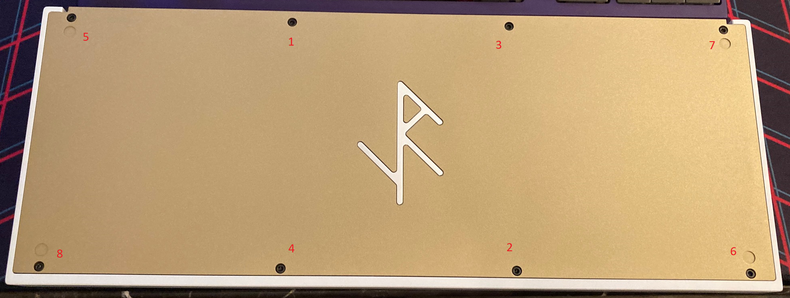

Moving back to position #1, use your free hand to squeeze the board tight compresing the gaskets all the way. The bottom of the board should be flush or close to flush with the bottom of the top case. Tighten the screw until it is finger tight.  DO NOT OVER TIGHTEN.  Repeat for the remaining seven screws once again following the position placements in order. This ensures even compression and mimimizes stress on screws and threads.

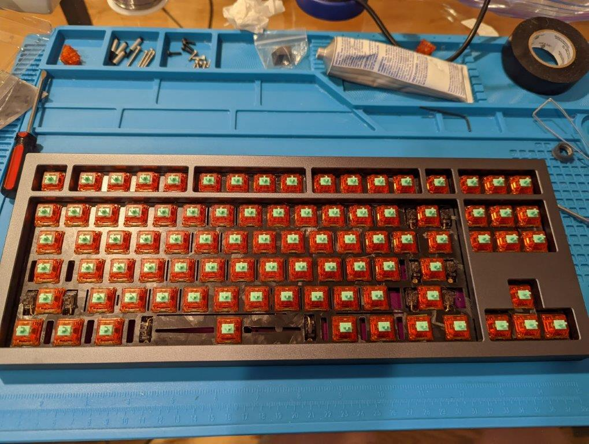

Now that your board is assembled, add your favorite keycaps and enjoy your Iron180!

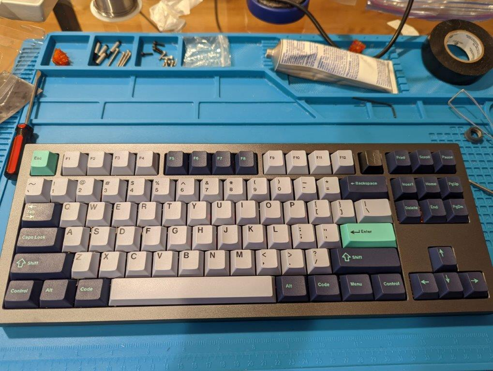
